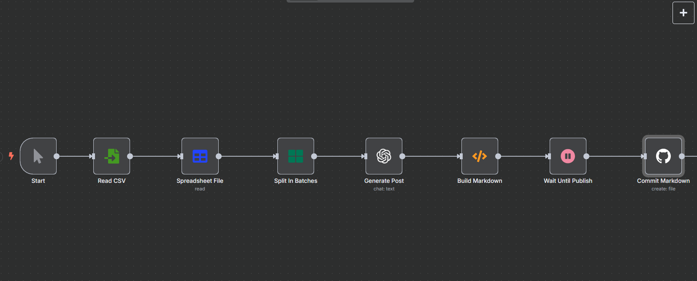

# jekyll-recipe-ai

Ricettario statico basato su **Jekyll** alimentato da un workflow **n8n** che genera, programma e pubblica articoli tramite **OpenAI** a partire da un semplice file CSV.

> **Autore**
> [Antonio Trento](https://antoniotrento.net)  ·  [LinkedIn](https://linkedin.com/in/antoniotrento)

---

## 🗂️ Cosa troverai in questo repository

| Percorso                  | Contenuto                                                         |
| ------------------------- | ----------------------------------------------------------------- |
| `_config.yml`             | Configurazione Jekyll (tema minima, lingua IT, future posts off)  |
| `Gemfile`                 | Dipendenze per lo sviluppo locale (`github-pages`)                |
| `_layouts/`               | Layout HTML minimi (`default`, `post`)                            |
| `_includes/`              | Header comune                                                     |
| `index.html`              | Homepage che elenca tutti i post                                  |
| `_posts/`                 | Cartella in cui il workflow n8n committa i markdown delle ricette |
| `images/n8n-workflow.png` | Diagramma del flusso (visualizzato qui sopra)                     |
| `_n8n/`                   | JSON del workflow n8n per import rapido                           |

---

## ⚙️ Come funziona

1. **CSV di input** – L’editor inserisce (o aggiorna) le righe in `posts.csv` con:
   `titolo;prompt_descrizione;keyword_principale;keyword_secondarie;data_pubblicazione`

2. **n8n Workflow**

   * ⏰ **Trigger Cron giornaliero** alle 07:00 CET
   * Legge il CSV e seleziona **solo la prima riga con data ≤ oggi**
   * Usa GPT-4o-mini per scrivere \~800-1000 parole (no front-matter)
   * Costruisce il file Markdown + front-matter Jekyll
   * Effettua il commit su `_posts/` del ramo `main` tramite PAT GitHub
   * (Opz.) Post su X / LinkedIn
   * ♻️ **Rimuove la riga appena pubblicata dal CSV** così il giorno dopo passerà alla successiva

3. **GitHub Pages** ricompila il sito e rende live la nuova pagina di ricetta.

---

## 📋 Schema CSV

| Colonna              | Descrizione                           | Esempio                                 |
| -------------------- | ------------------------------------- | --------------------------------------- |
| `titolo`             | Titolo leggibile                      | Risotto ai Funghi Porcini               |
| `prompt_descrizione` | Brief per il copywriter AI            | “Ricetta tradizionale… tecniche crema”  |
| `keyword_principale` | Keyword SEO primaria                  | risotto ai funghi porcini               |
| `keyword_secondarie` | Keyword secondarie (virgola-separate) | risotto cremoso, funghi porcini freschi |
| `data_pubblicazione` | Data/ora ISO 8601 (Europe/Rome)       | 2025-06-17 10:00                        |

---

## 🚀 Avvio rapido

```bash
# 1. Clona il repo
git clone https://github.com/antonio-backend-projects/jekyll-recipe-ai.git
cd jekyll-recipe-ai

# 2. (facoltativo) Servi il sito in locale
bundle install          # richiede Ruby + Bundler
bundle exec jekyll serve
```

### Impostare n8n

1. Importa `_n8n/jekyll-recipe-workflow.json` (o ricrea il flusso).

2. Crea queste credenziali:

   | Nome credenziale        | Scopo               | Scope / Permessi |
   | ----------------------- | ------------------- | ---------------- |
   | **GitHub API**          | commit su `_posts/` | PAT con `repo`   |
   | **OpenAI API**          | GPT-4o-mini         | key standard     |
   | (Opz.) **X / LinkedIn** | nodi social         | token app        |

3. Aggiorna nel nodo GitHub: **Owner** `antonio-backend-projects`, **Repo** `jekyll-recipe-ai`.

4. Copia `posts.csv` in `/home/ubuntu/n8n/jekyll/` (montato in `/data`).

5. Avvia il workflow; da lì parte ogni giorno in automatico.

---

## 🛠️ Personalizzazioni rapide

| Esigenza                   | Dove intervenire                                   |
| -------------------------- | -------------------------------------------------- |
| Aggiungere tag o categorie | Nodo **Build Markdown** → front-matter             |
| Numero di post al giorno   | Nodo **Split In Batches** → `batchSize`            |
| Disabilitare i social      | Scollega i nodi X / LinkedIn                       |
| Supporto immagini          | Riattiva i nodi “Generate Image” + commit relativo |

---

## 🐳 Esegui n8n con supporto `fs`

```bash
docker stop n8n && docker rm n8n   # ferma container esistente

docker run -d --name n8n \
  --restart unless-stopped \
  -p 5678:5678 \
  -v n8n_data:/home/node/.n8n \
  -v /home/ubuntu/n8n/jekyll:/data \
  -e N8N_SECURE_COOKIE=false \
  -e WEBHOOK_TUNNEL_URL=http://51.75.133.84:5678 \
  -e N8N_FILESYSTEM_ALLOW_LIST="/data" \
  -e NODE_FUNCTION_ALLOW_BUILTIN=fs \
  docker.n8n.io/n8nio/n8n
```

---

### 🚀 Prossime implementazioni

* 🖼️ **Generazione immagine del post via AI**
  Creare una cover 1024×1024 con prompt derivato dal titolo e committarla in `assets/img/`.

* 🤝 **Pubblicazione automatica sui social**

  * 🐦 Post su **X** con titolo + link alla ricetta
  * 🔗 Condivisione su **LinkedIn** (immagine opzionale, titolo + excerpt)


---

## 🤝 Contributi

1. Fai **fork** e crea un branch descrittivo (`feature/nuova-ricetta`).
2. Commit & push.
3. Apri una **pull request**: sarò felice di revisionarla!

---

## Licenza

Distribuito con licenza **MIT** – vedi `LICENSE` per i dettagli.
